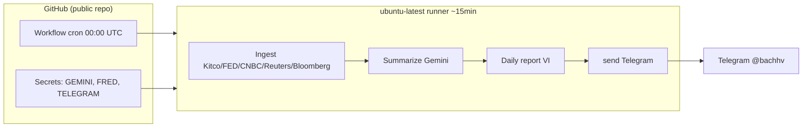

# Brainstorm: Deploy Daily Job (7h VN → Telegram)

**Date:** 2026-06-12  
**Status:** Approved — implemented (GitHub Actions workflow)  
**Scope:** Telegram-only daily pipeline on free platform

---

## Problem

GoldForecaster chạy tốt trên máy local (`python main.py --run-daily-job`) nhưng cần **tự động hóa hàng ngày lúc 7:00 sáng (Asia/Ho_Chi_Minh)** mà không trả phí hosting.

## Requirements (đã xác nhận)

| # | Yêu cầu |
|---|---------|
| R1 | Chạy full luồng: ingest → summarize → báo cáo VI → Telegram |
| R2 | Lịch cố định **07:00 giờ Việt Nam** |
| R3 | **Chỉ Telegram** — không cần dashboard/API online 24/7 |
| R4 | Platform **miễn phí**, **không cần thẻ** GCP |
| R5 | Repo **GitHub public** |

## Current System (rà soát code)

- Entry point: `main.py --run-daily-job` → `daily_job.py`
- Thời gian ước tính mỗi lần chạy: **10–25 phút** (Playwright + ~16–50 bài summarize × 8s delay + 1 lần Gemini báo cáo)
- Playwright bắt buộc cho **Reuters, Bloomberg**; Kitco/FED/CNBC dùng HTTP
- SQLite (`data/goldforecaster.db`) — **không cần persist** nếu chỉ gửi Telegram (mỗi lần chạy scrape + summarize từ đầu)
- Không dùng `--worker` (scheduler 24/7) — chỉ cần **one-shot cron**

## Approaches Evaluated

### Option A — GitHub Actions Scheduled Workflow ⭐ RECOMMENDED

**Cách hoạt động:** Workflow YAML chạy `python main.py --run-daily-job` theo cron UTC.

| Pros | Cons |
|------|------|
| $0 với repo public, không giới hạn phút | Cron UTC — phải tự quy đổi 7h VN → `0 0 * * *` |
| Zero server, secrets tích hợp | Trễ lịch 5–15 phút khi GitHub tải cao |
| `workflow_dispatch` để test thủ công | Repo không commit 60 ngày → GitHub tạm dừng schedule |
| Logs + email khi fail | IP datacenter GitHub có thể bị Reuters/Bloomberg chặn |
| Đủ 60 phút timeout cho pipeline | Mỗi lần cold-start: cài pip + Playwright (~3–5 phút) |

**Chi phí ước tính:** $0/tháng (public repo).

### Option B — Google Cloud Run Job + Cloud Scheduler

| Pros | Cons |
|------|------|
| Cron chính xác, timezone rõ | Cần tài khoản GCP (thường cần thẻ) — **user từ chối** |
| Container Playwright ổn định | Setup phức tạp hơn (Artifact Registry, IAM, Scheduler) |
| Retry, monitoring tốt | ~$0–3/tháng nhưng không zero-config |

**Verdict:** Tốt cho production sau này, **không phù hợp constraint hiện tại**.

### Option C — VM free 24/7 (Oracle Always Free / Fly.io)

| Pros | Cons |
|------|------|
| Chạy `--worker` như local | Overkill — trả giá complexity để chạy macro hourly không cần |
| SQLite persist | Oracle đăng ký khó; Fly free tier hạn chế |
| | Phải maintain OS, security patch |

**Verdict:** **Loại** — YAGNI, user chỉ cần 1 job/ngày.

---

## Recommended Solution: GitHub Actions

### Architecture



### Cron mapping

| Giờ VN (ICT, UTC+7) | Cron GitHub (UTC) |
|---------------------|-------------------|
| **07:00** | `0 0 * * *` |

> GitHub Actions chỉ hỗ trợ UTC. Không dùng `DAILY_JOB_*` env trên server — lịch nằm trong workflow YAML.

### Secrets cần thêm trên GitHub

| Secret | Bắt buộc |
|--------|----------|
| `GEMINI_API_KEY` | ✅ |
| `FRED_API_KEY` | ✅ |
| `TELEGRAM_BOT_TOKEN` | ✅ |
| `TELEGRAM_CHAT_ID` | ✅ |

Optional (có default trong code): `GEMINI_SUMMARIZE_MODELS`, `GEMINI_FORECAST_MODELS`, `GEMINI_REQUEST_DELAY_SECONDS`.

### Files cần tạo khi implement (chưa làm)

1. `.github/workflows/daily-job.yml` — schedule + manual trigger
2. `Dockerfile.job` (optional) — nếu sau này chuyển sang Cloud Run
3. Cập nhật `README.md` — hướng dẫn deploy + rotate secrets

### Workflow sketch (reference)

```yaml
name: Daily Gold Forecast
on:
  schedule:
    - cron: "0 0 * * *"   # 07:00 Asia/Ho_Chi_Minh
  workflow_dispatch:

jobs:
  run-daily-job:
    runs-on: ubuntu-latest
    timeout-minutes: 45
    steps:
      - uses: actions/checkout@v4
      - uses: actions/setup-python@v5
        with:
          python-version: "3.12"
      - run: pip install -r requirements.txt
      - run: playwright install --with-deps chromium
      - run: python main.py --run-daily-job
        env:
          GEMINI_API_KEY: ${{ secrets.GEMINI_API_KEY }}
          FRED_API_KEY: ${{ secrets.FRED_API_KEY }}
          TELEGRAM_BOT_TOKEN: ${{ secrets.TELEGRAM_BOT_TOKEN }}
          TELEGRAM_CHAT_ID: ${{ secrets.TELEGRAM_CHAT_ID }}
          PYTHONUNBUFFERED: "1"
```

---

## Risks & Mitigations

| Risk | Mức | Mitigation |
|------|-----|------------|
| Reuters/Bloomberg chặn IP GitHub | Trung bình | Pipeline vẫn chạy với Kitco+CNBC+FED; monitor `sources_failed` trong log |
| Gemini 429/503 | Trung bình | Model pool đã có; giữ `GEMINI_REQUEST_DELAY_SECONDS=8` |
| Job >45 phút khi nhiều tin | Thấp | `timeout-minutes: 60`; giảm `SUMMARIZE_BATCH_LIMIT` nếu cần |
| Token/API key lộ trên repo | Cao | **Chỉ dùng GitHub Secrets**; revoke token Telegram đã lộ trước đó |
| GitHub pause schedule | Thấp | Commit bất kỳ 60 ngày/lần hoặc chạy manual `workflow_dispatch` |
| Không nhận báo cáo khi job fail | Trung bình | Phase 2: gửi Telegram alert khi exit code ≠ 0 |

---

## Success Criteria

- [ ] Workflow chạy thành công qua `workflow_dispatch` (test thủ công)
- [ ] Nhận báo cáo forecast đầy đủ trên Telegram
- [ ] Cron tự chạy trong cửa sổ **07:00–07:20** giờ VN
- [ ] Không có secret trong git history
- [ ] Log Actions hiển thị rõ: inserted articles, summarized count, telegram sent

---

## Out of Scope (YAGNI)

- Host dashboard Next.js
- API FastAPI 24/7
- SQLite persist / backup giữa các lần chạy
- `--worker` scheduler (macro hourly, news 4x/day)

---

## Next Steps (sau khi approve)

1. Push code lên GitHub public (đảm bảo `.env` trong `.gitignore`)
2. Thêm 4 secrets trên repo Settings → Secrets
3. Tạo workflow `daily-job.yml`
4. Chạy `workflow_dispatch` test
5. Đợi cron ngày hôm sau xác nhận

**Ước tính effort:** ~30–45 phút implement + 1 ngày chờ cron verify.
